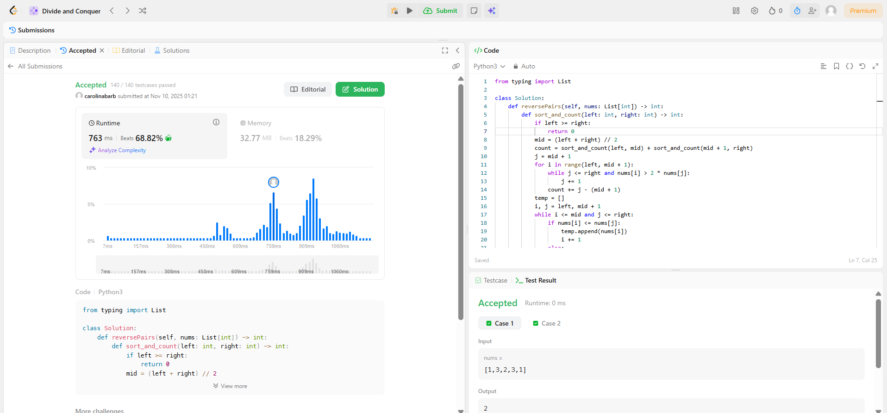
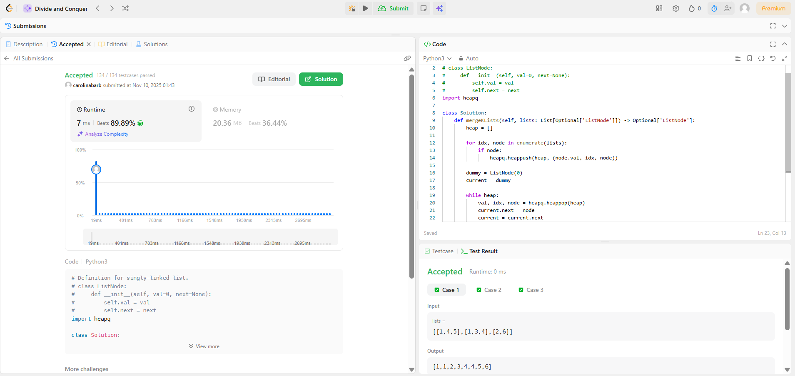

# D12 - Dividir e Conquistar - LeetCode

**Número da Lista**: 04 

**Conteúdo da Disciplina**: FGA0124 - PROJETO DE ALGORITMOS - T01  

## Alunos

<table>
  <tr>
    <td align="center"><a href="https://github.com/CarolinaBarb"> <b>Carolina Barbosa </b></a> </td>
    <td align="center"><a href="https://github.com/JuliaSSouza"> <b>Julia Sant'Anna</b></a> 
  </tr>
</table>

| Matrícula   | Aluno                             |
| ----------- | ---------------------------------- |
| 211030961 | Carolina Barbosa Brito           |
| 202044144  | Julia Sant'Anna de Souza      |

## Sobre 

## Exercício 1 - Kth Largest Element in an Array
### Descrição.

Este problema consiste em encontrar o k-ésimo maior elemento em um array de inteiros, considerando a ordem após a ordenação, mas sem necessariamente ordenar todo o array. Uma abordagem eficiente é usar o algoritmo de Quickselect, que particiona o array em torno de um pivô de forma semelhante ao Quicksort, ou utilizar um heap mínimo de tamanho k para manter sempre os k maiores elementos vistos até o momento. Assim, é possível obter o k-ésimo maior com complexidade média O(n) (Quickselect) ou O(n log k) (heap), sem precisar ordenar completamente a estrutura.

- Dificuldade: Médio
- Link: https://leetcode.com/problems/kth-largest-element-in-an-array/
- Solução: [Código](/Documentos/KhLargestElement.py)

## Exercício 2 - Median of Two Sorted Arrays
### Descrição.
Este problema envolve encontrar a mediana de dois arrays já ordenados, com tamanhos possivelmente diferentes, garantindo uma complexidade de tempo O(log (m + n)). A ideia é aplicar busca binária na menor das duas listas para encontrar uma partição que divida o conjunto combinado em duas metades, de modo que todos os elementos da metade esquerda sejam menores ou iguais aos da metade direita. Com essa partição válida, a mediana é calculada a partir dos elementos das bordas das duas metades (máximo da esquerda e mínimo da direita), tratando separadamente os casos de quantidade total de elementos par ou ímpar.

- Dificuldade: Difícil
- Link: https://leetcode.com/problems/median-of-two-sorted-arrays/
- Solução: [Código](/Documentos/MedianOfTwoSorted.py)

## Exercício 3 - Reverse Pairs
### Descrição.
Este problema envolve contar o número de reverse pairs em um array de inteiros, onde um par (i, j) é considerado válido se i < j e nums[i] > 2 * nums[j]. Uma solução eficiente é baseada em um merge sort modificado, que utiliza a estratégia de divisão e conquista: o array é recursivamente dividido em duas metades e, em cada etapa, além de ordenar essas metades, contamos quantos pares válidos existem entre a metade esquerda e a metade direita. Como essas metades estão ordenadas, é possível usar dois ponteiros para contar os pares em tempo linear por nível de recursão, resultando em uma complexidade total de O(n log n), bem mais eficiente do que a abordagem ingênua de O(n^2).

- Dificuldade: Difícil
- Link: https://leetcode.com/problems/reverse-pairs/
- Solução: [Código](/Documentos/ReversePairs.py)

## Exercício 4 - Merge k Sorted Lists
### Descrição.
Este problema envolve mesclar k listas simplesmente encadeadas já ordenadas em ordem crescente em uma única lista também ordenada. Uma solução eficiente utiliza um min-heap (estrutura de prioridade) para sempre extrair o nó de menor valor entre as k listas. Inicialmente, insere-se no heap o primeiro nó de cada lista; em seguida, repetidamente remove-se o menor elemento do heap, anexando-o à lista resultado, e se o nó removido tiver um próximo, este também é inserido no heap. Esse processo continua até que todos os nós tenham sido processados, resultando em uma complexidade de tempo O(N log k), onde N é o número total de elementos e k é a quantidade de listas.

- Dificuldade: Difícil
- Link: https://leetcode.com/problems/merge-k-sorted-lists/
- Solução: [Código](/Documentos/MergekSorted.py)