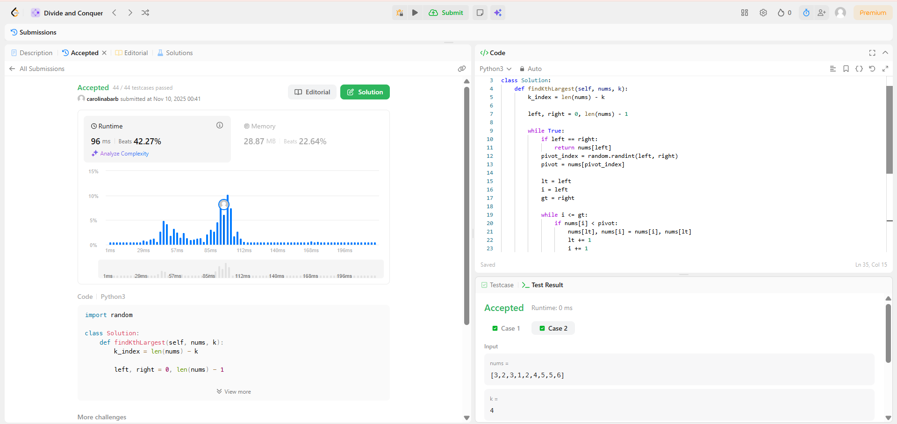
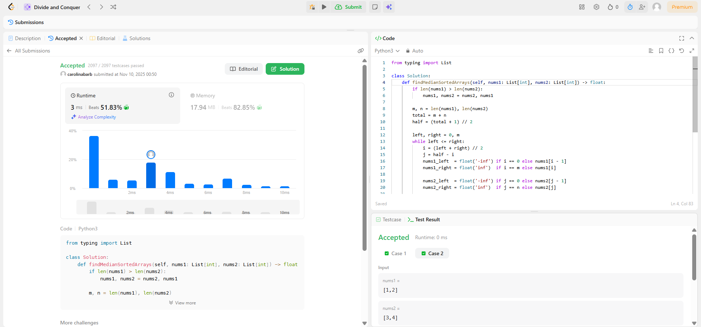

# D12 - Dividir e Conquistar - LeetCode

**Número da Lista**: 04 

**Conteúdo da Disciplina**: FGA0124 - PROJETO DE ALGORITMOS - T01  

## Alunos

<table>
  <tr>
    <td align="center"><a href="https://github.com/CarolinaBarb"> <b>Carolina Barbosa </b></a> </td>
    <td align="center"><a href="https://github.com/JuliaSSouza"> <b>Julia Sant'Anna</b></a> 
  </tr>
</table>

| Matrícula   | Aluno                             |
| ----------- | ---------------------------------- |
| 211030961 | Carolina Barbosa Brito           |
| 202044144  | Julia Sant'Anna de Souza      |

## Sobre 

## Exercício 1 - Kth Largest Element in an Array
### Descrição.

Este problema consiste em encontrar o k-ésimo maior elemento em um array de inteiros, considerando a ordem após a ordenação, mas sem necessariamente ordenar todo o array. Uma abordagem eficiente é usar o algoritmo de Quickselect, que particiona o array em torno de um pivô de forma semelhante ao Quicksort, ou utilizar um heap mínimo de tamanho k para manter sempre os k maiores elementos vistos até o momento. Assim, é possível obter o k-ésimo maior com complexidade média O(n) (Quickselect) ou O(n log k) (heap), sem precisar ordenar completamente a estrutura.

- Dificuldade: Médio
- Link: https://leetcode.com/problems/kth-largest-element-in-an-array/
- Solução: [Código]()

## Exercício 2 - Median of Two Sorted Arrays
### Descrição.
Este problema envolve encontrar a mediana de dois arrays já ordenados, com tamanhos possivelmente diferentes, garantindo uma complexidade de tempo O(log (m + n)). A ideia é aplicar busca binária na menor das duas listas para encontrar uma partição que divida o conjunto combinado em duas metades, de modo que todos os elementos da metade esquerda sejam menores ou iguais aos da metade direita. Com essa partição válida, a mediana é calculada a partir dos elementos das bordas das duas metades (máximo da esquerda e mínimo da direita), tratando separadamente os casos de quantidade total de elementos par ou ímpar.

- Dificuldade: Difícil
- Link: https://leetcode.com/problems/median-of-two-sorted-arrays/
- Solução: [Código]()

## Exercício 3 - 
### Descrição.

- Dificuldade: 
- Link: 
- Solução: [Código]()

## Exercício 4 - 
### Descrição.

- Dificuldade: 
- Link: 
- Solução: [Código]()